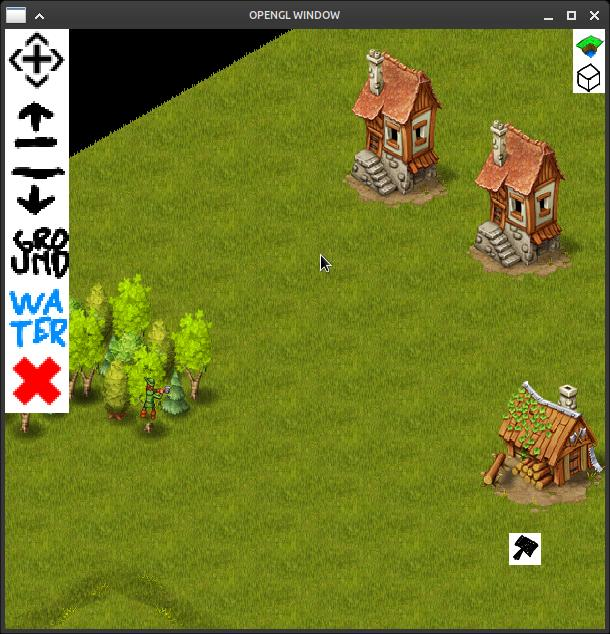
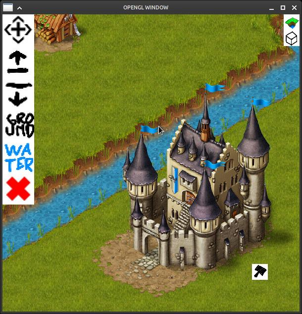
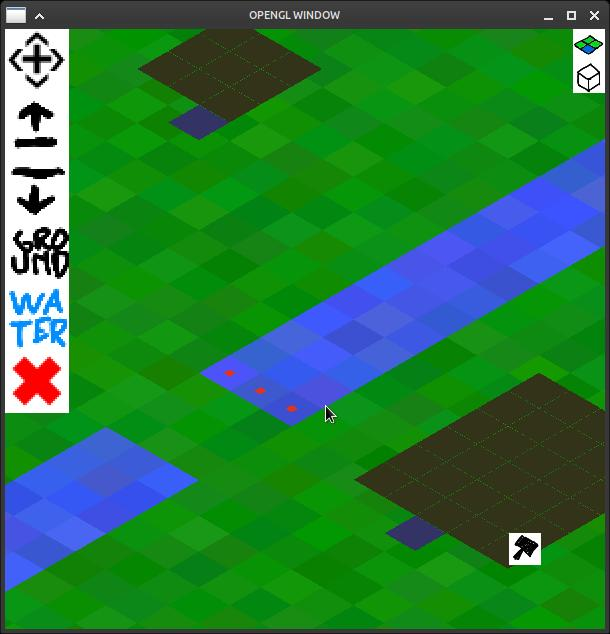

# Clone of Townsmen
## Compiling
```sh
cmake -GNjinja -B build
cmake -j8 -C build
```
## Running
Before running the program find Townsmen.apk and extract the assets to `assets` directory. Run the program from build directory
```sh
cd build
./run
```

# Screenshot


